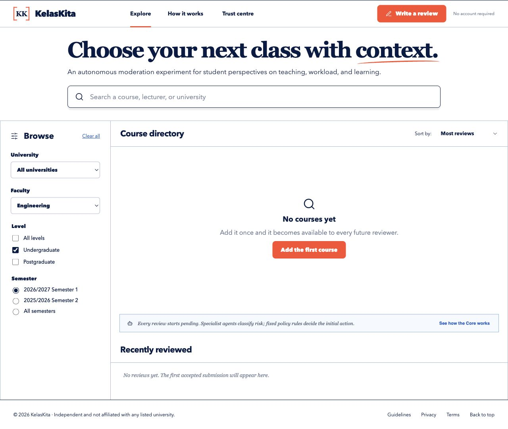

# KelasKita

An independent, no-account-required platform for student perspectives on courses and lecturers.



## What it does

- Stores courses and lecturers separately, including multiple lecturers for one course.
- Starts every review as pending and excludes it from ratings until publication.
- Flags threats, personal information and serious allegations for moderation.
- Provides reporting, appeals, lecturer replies and reversible human decisions.
- Keeps private contacts, moderation records and abuse controls on the server.

The moderation model classifies risk; it never decides whether a claim is true, fraudulent, defamatory or criminal. Grave allegations are held for human review.

## Development

Node.js 22 or newer is required.

```bash
cd app
npm install
npm test
npm run build
npm run dev
```

Vite serves the interface. End-to-end API development requires a linked Vercel project:

```bash
vercel link
vercel env pull .env.local
vercel dev
```

## Deployment

Import this repository into Vercel with:

- Root Directory: `app`
- Framework Preset: `Vite`
- `SUBMISSIONS_OPEN=false` until the production checks and human launch gates pass

The full operator setup lives in [`app/docs/DEPLOYMENT.md`](app/docs/DEPLOYMENT.md). It covers Postgres, AI Gateway, Turnstile, Cloudflare and production verification.

KelasKita is not affiliated with any university and does not use university logos.
